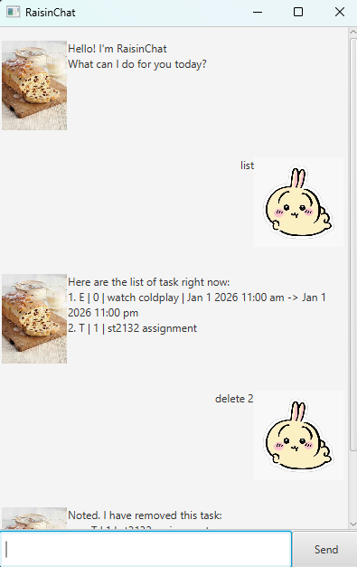

# RaisinChat 🍇


**RaisinChat** is a desktop application for managing tasks, optimized for users who prefer a Command Line Interface (CLI) experience but want the visual benefits of a Graphical User Interface (GUI).



> **Note:** This project is currently in active development.

---

## 📖 Table of Contents
- [About](#about)
- [Features](#features)
- [Getting Started](#getting-started)
    - [Prerequisites](#prerequisites)
    - [Installation](#installation--running)
- [Usage](#usage)
- [Data Storage](#data-storage)
- [Testing](#testing)

---

## About
RaisinChat helps you keep track of your daily tasks, deadlines, and events. It bridges the gap between a text-based chatbot and a modern desktop application.

## Features

* **GUI Interface:** A clean, responsive interface built with JavaFX.
* **Task Management:** Add, delete, and list various types of tasks.
* **Persistent Storage:** Automatically saves your tasks to the hard drive so you never lose data.
* **Smart Parsing:** Understands natural language commands (e.g., "deadline submit report /by Monday").

---

## Getting Started

### Prerequisites
Ensure you have the following installed on your machine:
* **Java 17** or higher (required to run the application).
    * *To check if you have it installed, open your terminal and run:* `java -version`

### Installation & Running
1.  **Download the Release**
    * Go to the [Releases page](https://github.com/RaisinMoldyBread/ip/releases/tag/A-Release) on GitHub.
    * Download the latest `RaisinChat.jar` file.

2.  **Run the Application**
    * Open a command terminal (Command Prompt, PowerShell, or Terminal).
    * Navigate to the folder where you downloaded the file.
    * Run the following command:
    ```bash
    java -jar RaisinChat.jar
    ```

---

## Usage

Once the application launches, you can interact with RaisinChat using the text input box.

### Common Commands

| Action           | Command Format                         | Example                                                           |
|:-----------------|:---------------------------------------|:------------------------------------------------------------------|
| **Print Help**   | `help`                                 | `help`                                                            |
| **Add Todo**     | `todo <description>`                   | `todo Buy grapes`                                                 |
| **Add Deadline** | `deadline <desc> /by <date>`           | `deadline Return book /by 2024-02-20 10:00 AM`                    |
| **Add Event**    | `event <desc> /from <start> /to <end>` | `event Meeting /from 2024-02-20 10:00 AM /to 2024-02-20 11:00 AM` |
| **List Tasks**   | `list`                                 | `list`                                                            |
| **Mark Done**    | `mark <task_index>`                    | `mark 1`                                                          |
| **Unmark Done**  | `unmark <task_index>`                  | `unmark 1`                                                        |
| **Delete Task**  | `delete <task_index>`                  | `delete 3`                                                        |
| **Exit**         | `bye`                                  | `bye`                                                             |


More commands will be featured at the 'help' command

## Data Storage

RaisinChat automatically saves your data to a local file.
* **File Location:** `./data/RaisinChatTaskDb.txt`
* **Behavior:** The file is updated after every command that modifies the task list. If the file does not exist, it will be created automatically on startup.

---

## Testing

We use JUnit for testing. The project includes a `TestFixtures` class to provide consistent objects for unit tests.

To run tests:
1.  **Clone the repository**
    ```bash
    
    git clone [https://github.com/RaisinMoldyBread/RaisinChat.git](https://github.com/YOUR_USERNAME/RaisinChat.git)
    
    ```
2.  Open in IntelliJ IDEA
    * File > Open > Select the `RaisinChat` folder.
3.  Open the **Gradle** (or Maven) tab in your IDE.
2.  Navigate to `Tasks` > `verification`.
3.  Double-click `test`.

The tests use a separate database file (`./data/RaisinChatTaskTestDb.txt`) to ensure your actual data is not overwritten during testing.

---

## Contact
Created by **RaisinMoldyBread** - feel free to contact me at **dylankoh@u.nus.edu**!